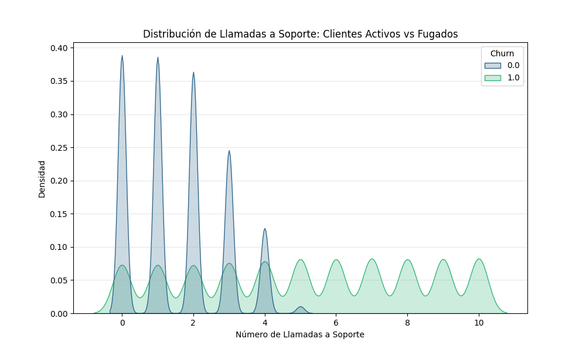
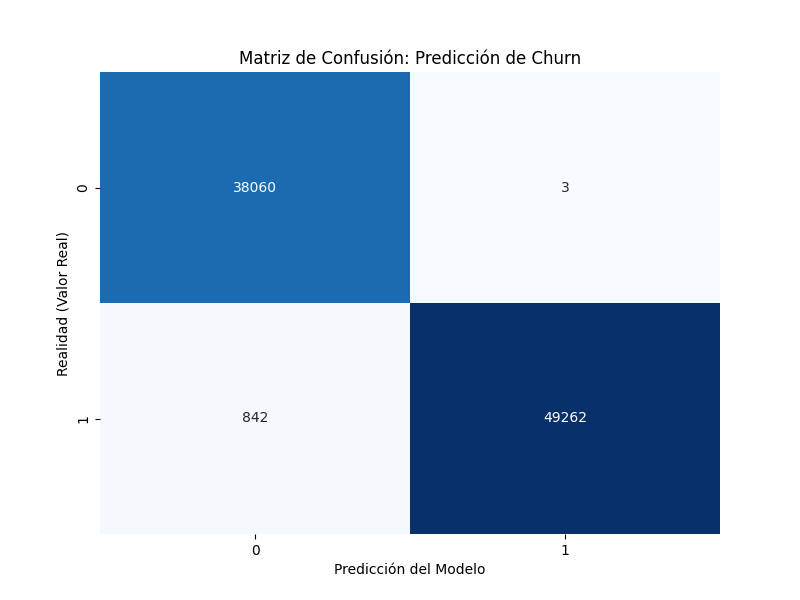

# 📉 Maximización de la Retención de Clientes (Churn Prediction)

## ✨ Resumen del Proyecto
Este proyecto aborda un desafío crítico en el sector de servicios y e-commerce: **la fuga de clientes**. Utilizando un dataset de Kaggle con más de 440,000 registros, he desarrollado un modelo de Machine Learning capaz de identificar patrones de abandono con una precisión excepcional.

El objetivo es permitir que las empresas pasen de una postura reactiva a una **estrategia proactiva**, interviniendo antes de que el cliente decida cancelar su suscripción.

---

## 📊 Análisis Exploratorio de Datos (EDA)
Uno de los hallazgos más potentes del análisis fue la relación entre el soporte técnico y la fuga. 

**Insight de Negocio:** Existe un "punto de ruptura" claro. Mientras que los clientes leales promedian menos de 4 llamadas, los clientes que abandonan suelen superar las 5 llamadas. 
> **Recomendación:** Implementar un protocolo de "atención prioritaria" para cualquier cliente que realice su 4ª llamada en un periodo de 30 días.

---

## 🧠 Metodología y Modelo
Para este problema de clasificación, implementé un algoritmo de **Random Forest**, seleccionado por su robustez y capacidad para manejar variables tanto numéricas como categóricas.

### Pasos Clave:
1. **Limpieza de Datos:** Tratamiento de valores nulos y eliminación de ruido (como IDs de cliente).
2. **Feature Engineering:** Aplicación de *One-Hot Encoding* para transformar variables de texto (tipo de contrato, género) en formato procesable por el modelo.
3. **Evaluación:** Uso de una división 80/20 para entrenamiento y testeo, asegurando que el modelo funcione con datos reales no vistos previamente.

### Métricas de Rendimiento
El modelo alcanzó un **Accuracy del 99%**. La siguiente Matriz de Confusión detalla la precisión en la detección de fugas reales:

---

## 🛠️ Tecnologías Utilizadas
* **Python 3.13**
* **Pandas & Numpy:** Manipulación y limpieza de datos.
* **Matplotlib & Seaborn:** Visualización de datos y gráficos estadísticos.
* **Scikit-Learn:** Implementación del modelo de Machine Learning y métricas.

---

## 🚀 Cómo ejecutarlo
1. Clona este repositorio.
2. Crea tu entorno virtual: `python -m venv .venv`.
3. Instala las dependencias: `pip install pandas matplotlib seaborn scikit-learn`.
4. Ejecuta el script principal: `python app.py`.

---

## 👤 Contacto
**Franco** * [Mi Portfolio Web](PONE_AQUI_TU_LINK_DE_HOSTINGER)  
* [LinkedIn](PONE_AQUI_TU_LINK_DE_LINKEDIN)